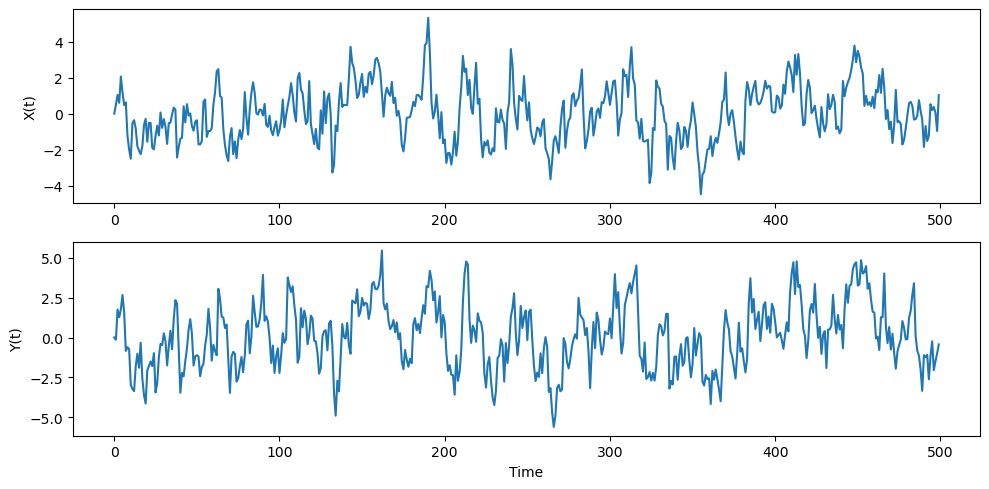

# Granger Causality Experiment: Unidirectional Causality

## Experiment Overview

This experiment demonstrates Granger causality testing on simulated time series data with a known unidirectional causal relationship: **X → Y**.

## Libraries Used

- **numpy**: Data generation and numerical operations
- **pandas**: Data structure and manipulation
- **matplotlib**: Time series visualization
- **statsmodels**: Statistical tests
  - `adfuller`: Augmented Dickey-Fuller test for stationarity
  - `grangercausalitytests`: Granger causality test

## Data Generating Process (DGP)

The experiment uses the following linear autoregressive model:

```
X(t) = 0.8 × X(t-1) + ε₁
Y(t) = 0.5 × Y(t-1) + 0.6 × X(t-1) + ε₂
```

Where:
- **X** is an AR(1) process (autoregressive order 1)
- **Y** depends on both its own past and X's past
- **ε₁, ε₂** ~ N(0, 1) are independent white noise terms

**Key feature**: Y explicitly depends on X(t-1), but X does NOT depend on Y. This creates a clear unidirectional causality: X → Y.

## Experimental Workflow

1. **Data Generation**: Generate 500 time points using the DGP
2. **Stationarity Testing**: Apply ADF test to both X and Y
3. **Granger Causality Testing**: Test both directions (X → Y and Y → X)
4. **Visualization**: Plot time series to observe patterns

## Experimental Results

### 1. Stationarity Tests (ADF)

| Variable | ADF Statistic | P-value | Result |
|----------|--------------|---------|--------|
| X        | -7.947       | 0.0000  | ✓ Stationary |
| Y        | -7.766       | 0.0000  | ✓ Stationary |

**Interpretation**:
- Both series have highly negative ADF statistics (< -3.43 critical value at 1%)
- P-values ≈ 0, strongly rejecting the null hypothesis of unit root
- **Conclusion**: Both X and Y are stationary, satisfying the prerequisite for Granger causality testing

### 2. Granger Causality Tests

#### Direction: X → Y (Expected: SIGNIFICANT)

| Lag | F-statistic | P-value  | Significance |
|-----|-------------|----------|--------------|
| 1   | 299.19      | 0.0000   | ***          |
| 2   | 149.97      | 0.0000   | ***          |
| 3   | 99.28       | 0.0000   | ***          |
| 4   | 75.19       | 0.0000   | ***          |
| 5   | 59.48       | 0.0000   | ***          |

**Interpretation**:
- All lags show **extremely high F-statistics** (299.19 → 59.48)
- All p-values = 0.0000 (< 0.01), indicating strong significance
- **Conclusion**: ✓ X **significantly** Granger-causes Y at all tested lags

#### Direction: Y → X (Expected: NOT SIGNIFICANT)

| Lag | F-statistic | P-value  | Significance |
|-----|-------------|----------|--------------|
| 1   | 0.11        | 0.7380   |              |
| 2   | 0.56        | 0.5717   |              |
| 3   | 0.64        | 0.5883   |              |
| 4   | 0.27        | 0.8952   |              |
| 5   | 0.19        | 0.9672   |              |

**Interpretation**:
- All lags show **very low F-statistics** (0.11 → 0.64)
- All p-values > 0.57 (far above 0.05 threshold)
- **Conclusion**: ✓ Y does **NOT** Granger-cause X at any tested lag

### 3. Visualization



**Observations**:
- **X(t)**: Fluctuates around zero with range ≈ [-4, 4], exhibiting AR(1) characteristics
- **Y(t)**: Fluctuates around zero with range ≈ [-5, 5], shows similar but independent patterns
- Both series are **mean-reverting** and **stationary**, consistent with ADF test results
- Visual patterns suggest X and Y share some dependency structure (as designed in DGP)

## Result Analysis

### Summary

| Test Direction | Result | Matches Expectation |
|----------------|--------|---------------------|
| X → Y          | ✓ Significant | ✓ Yes |
| Y → X          | ✗ Not Significant | ✓ Yes |

### Key Findings

1. **Successful Detection of Unidirectional Causality**
   - The Granger test correctly identified that X Granger-causes Y
   - The test correctly rejected causality in the reverse direction (Y → X)
   - Results perfectly match the data generating process

2. **Strong Statistical Evidence**
   - X → Y: F-statistics range from 59.48 to 299.19 (extremely high)
   - Y → X: F-statistics range from 0.11 to 0.64 (very low)
   - Clear distinction between causal and non-causal directions

3. **Lag Structure Analysis**
   - F-statistic decreases as lag increases for X → Y (299.19 → 59.48)
   - This suggests the strongest predictive power comes from lag 1 (X(t-1))
   - Consistent with DGP where Y(t) directly depends on X(t-1) with coefficient 0.6
