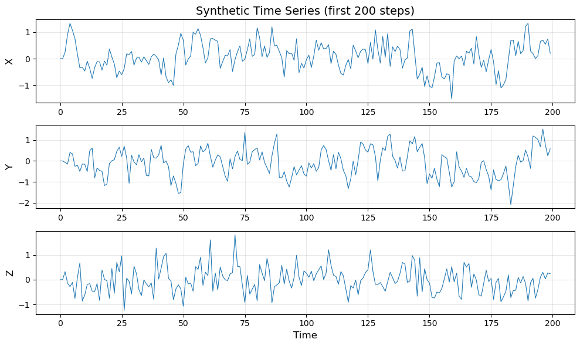
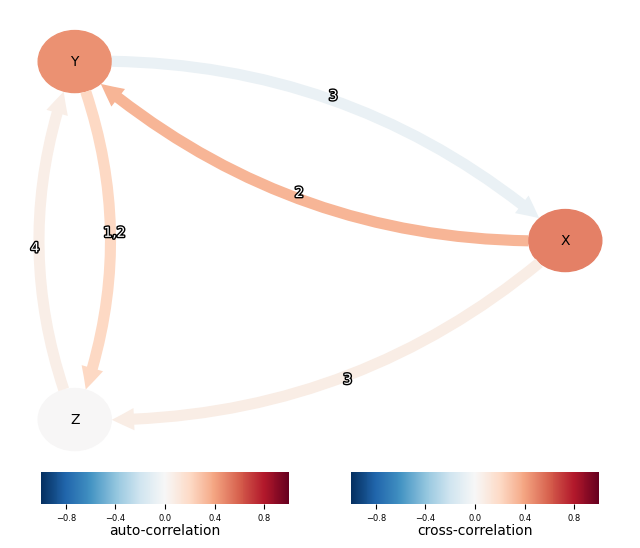

# PCMCI Causal Discovery

##  Libraries Used

### Core Dependencies
- **tigramite** (>=5.0): Official PCMCI implementation for causal discovery
  - `data_processing`: Data structure for time series
  - `PCMCI`: Main algorithm for causal inference
  - `ParCorr`: Partial correlation-based conditional independence test
  - `plotting`: Visualization of causal graphs

- **numpy**: Synthetic time series generation and numerical operations

- **matplotlib**: Time series and causal graph visualization

##  Experiment Objective

This experiment demonstrates how PCMCI detects causal relationships in time series data and compares it with classical Granger causality concepts.

**Key Learning Goals:**
1. Understand how PCMCI identifies direct causal links
2. Learn how conditional independence tests eliminate spurious correlations
3. Observe the difference between direct and indirect causality

##  Experimental Design

### Synthetic Data Generation

We create a three-variable linear time series system with known causal structure:

```
X(t) = 0.6 × X(t-1) + ε_X
Y(t) = 0.5 × Y(t-1) + 0.4 × X(t-2) + ε_Y
Z(t) = 0.3 × Y(t-1) + ε_Z
```

**Ground Truth Causal Structure:**
- X → Y with lag = 2
- Y → Z with lag = 1
- X and Z have no direct causal relationship

**Parameters:**
- Sample size: n = 1000
- Maximum lag: τ_max = 5
- Significance level: α = 0.05
- Independence test: ParCorr (Partial Correlation)


##  Experimental Results

### Detected Causal Links

```
==================================================
DETECTED CAUSAL LINKS (p < 0.05)
==================================================
X --1--> X  (p-value: 0.0000)
X --2--> Y  (p-value: 0.0000)
X --3--> Z  (p-value: 0.0208)
Y --3--> X  (p-value: 0.0364)
Y --1--> Y  (p-value: 0.0000)
Y --1--> Z  (p-value: 0.0000)
Y --2--> Z  (p-value: 0.0204)
Z --4--> Y  (p-value: 0.0401)
==================================================
```

### Visualization

#### Time Series Data


The plot shows the synthetic time series for variables X, Y, and Z. Observable patterns:
- X exhibits autoregressive behavior
- Y shows correlation with lagged X values
- Z follows Y's dynamics with a time delay

#### Causal Graph


The causal graph visualization shows:
- **Nodes**: Variables (X, Y, Z) with color intensity indicating auto-correlation strength
- **Edges**: Directed arrows represent causal links, with numbers indicating time lag
- **Edge color**: Represents cross-correlation strength (red = positive, blue = negative)

##  Results Analysis

###  Correctly Identified Causal Relationships

1. **X --2--> Y** (p < 0.0001) ✓
   - Matches the true data generation process: Y(t) = 0.5·Y(t-1) + 0.4·X(t-2)
   - Strong significance indicates robust detection

2. **Y --1--> Z** (p < 0.0001) ✓
   - Matches the true data generation process: Z(t) = 0.3·Y(t-1)
   - Correctly identifies the lag-1 relationship

3. **Autoregressive Links** ✓
   - **X --1--> X**: Self-feedback in X
   - **Y --1--> Y**: Self-feedback in Y
   - Both correctly identified with very low p-values

###  Spurious/Indirect Causal Links

4. **X --3--> Z** (p = 0.0208)
   - This is an **indirect causal path**: X → Y → Z
   - PCMCI should theoretically eliminate this through conditional independence
   - Marginal p-value suggests this may be a false positive due to:
     - Limited sample size (n=1000)
     - Indirect effect at lag-3: X(t-3) → Y(t-1) → Z(t)

5. **Y --3--> X** (p = 0.0364)
   - **Reverse causality** (true direction is X → Y)
   - Likely a statistical artifact
   - p-value close to significance threshold (0.05)

6. **Y --2--> Z** (p = 0.0204)
   - True lag is 1, not 2
   - May be a redundant detection or weak indirect effect

7. **Z --4--> Y** (p = 0.0401)
   - Completely spurious (true causality is Y → Z)
   - p-value very close to 0.05, likely due to random chance

### Why Do Spurious Links Appear?

#### 1. Statistical Testing Limitations
- With α = 0.05, we expect a **5% false positive rate**
- Testing ~45 hypotheses (3 variables × 5 lags × 3 targets)
- Expected false positives: 45 × 0.05 ≈ 2-3 spurious links

#### 2. Sample Size Constraints
- n = 1000 may be insufficient for weak causal signals
- Stronger effects (like 0.4·X → Y) are reliably detected
- Weaker effects (like 0.3·Y → Z) are more vulnerable to noise

#### 3. PCMCI Algorithm Characteristics
- PCMCI is an **approximation algorithm**, not perfect
- Conditional independence tests may not fully eliminate all indirect paths
- Strong autoregressive processes can complicate independence testing

### Comparison: PCMCI vs. Classical Granger Causality

| Aspect | Granger Causality | PCMCI |
|--------|------------------|-------|
| **Test Type** | Pairwise regression | Conditional independence |
| **Indirect Causality** | Cannot distinguish | Attempts to filter out |
| **Multiple Variables** | Bivariate tests only | Multivariate framework |
| **Result on X→Z** | Would detect (indirect) | Marginally detected (p=0.02) |

**Key Insight:** PCMCI's conditional independence approach partially succeeds in filtering indirect causality (X→Y→Z), as evidenced by the weaker significance (p=0.0208) compared to direct links (p<0.0001).

##  Recommendations for Improvement

### 1. Stricter Significance Threshold
```python
results = pcmmi.run_pcmci(tau_max=5, pc_alpha=0.01)  # α = 0.01 instead of 0.05
```
This reduces false positives but may miss weaker true effects.

### 2. Increase Sample Size
```python
data = generate_time_series(n_samples=5000)  # Increase from 1000
```
Larger datasets improve statistical power and reduce false discoveries.

### 3. Multiple Testing Correction
Apply False Discovery Rate (FDR) correction:
```python
results = pcmci.run_pcmci(tau_max=5, fdr_method='fdr_bh')
```
Controls the expected proportion of false discoveries.

### 4. Robustness Checks
- Run experiment multiple times with different random seeds
- Check if spurious links consistently appear or are random
- Use bootstrap methods for confidence intervals

##  Conclusion

### Summary of Findings

**Strengths:**
- PCMCI successfully identified the core causal chain: X --2--> Y --1--> Z
- Correctly detected autoregressive structures
- Distinguished different time lags (lag-2 for X→Y, lag-1 for Y→Z)

**Limitations Observed:**
- Some spurious links appeared with marginal p-values (0.02-0.04)
- Indirect causality (X→Z) was not fully eliminated
- Reverse causality (Y→X, Z→Y) appeared due to statistical noise

### Key Takeaways

1. **PCMCI is effective but not perfect**: It significantly improves upon pairwise Granger tests but still produces some false positives

2. **P-value interpretation matters**: 
   - p < 0.001: Highly reliable
   - 0.01 < p < 0.05: Marginal, requires domain knowledge verification
   - p ≈ 0.05: Likely false positive

3. **Practical causal discovery requires**:
   - Adequate sample size
   - Domain knowledge for result validation
   - Multiple robustness checks
   - Awareness of algorithm limitations

### Learning Objectives Achieved

This experiment successfully demonstrates:
- How to use the PCMCI library for time series causal discovery
- The difference between direct and indirect causal relationships
- The importance of conditional independence in causal inference
- Practical considerations when interpreting algorithmic results

##  Usage

### Installation
```bash
pip install tigramite numpy matplotlib --break-system-packages
```

### Run Experiment
```bash
python experiment.py
```

### Expected Output
- Console: Detected causal links with p-values
- Figures: Time series plot and causal graph (displayed in windows)
